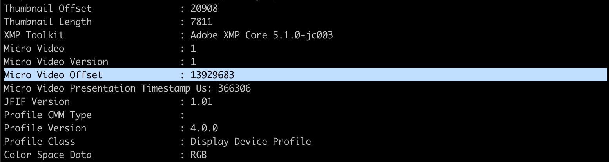

# GoogleMotionPhotosToGif
## - Or Google Motion Photos To MP4 To Gif

## Dependencies 
* Python3 (tested on Python 3.7.3)
* ffmpeg - https://www.ffmpeg.org/ 

### Installation
#### On Linux
`$ sudo apt-get install ffmpeg`</br>

#### On Mac
`$ brew install ffmpeg`</br>

## Usage

This small python script can just be executed after being copied in your unzipped 'Takeout' folder that you get from https://takeout.google.com/ where you export all your selected photo folders. Use this line to get all Motion of your Motion Photos as GIFs:

```
$ python3 ./motion_photo_to_gif.py
```

# Explanation:

Within all your folders, for example `Takeout/Google Photos/2019-03-30` you have normally three files for each normal photo you took:

* `MVIMG_20200315_182332.jpg.json` - This file contains **metadata** like the link to the original photo.

* `MVIMG_20200315_182332.jpg` - The **whole motion picture** as JPG wich can be normally opened and viewed but that has the 'Motion'-part, the video saved at the end of the picture part.

By typing the following command you can get exactly the offset which contains the video part:
```
$ exiftool MVIMG_20200315_182332.jpg
```


With this information you could extract the video part of each Motion Photo yourself but Google Takeout has already done it for you in the third file.

* `MVIMG_20200315_182332(1).jpg` - This is the **video part** of your Motion Photo. By renaming it to MVIMG_20200315_182332(1).mp4 you can use it as a normal MP4 and watch it with your usual player. By running the script `motion_photo_to_gif.py` and commenting out line 18 to the end of the script with the `#` symbol you can get this done automatically for all of those video part files.

If you run the script without commenting out anything all video part files in all subfolders and albums will be automatically converted from mp4 to gif and additionally get the right date as metadata saved into the new GIF file.
